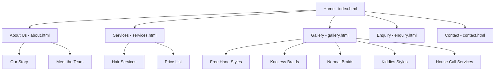

# WEDE5020 Part 2 - Ketshengana Hair Studio

## Changelog

### Part 1 Feedback Corrections
Based on the feedback received for Part 1, the following improvements were implemented:
*   **Sitemap:** Created and added a comprehensive visual sitemap to the repository to address the missing planning elements. (See below)
*   **Goals & Objectives:** Expanded the goals to be specific and measurable (e.g., targeting a specific number of monthly bookings) to address the "lack of detail" feedback.
*   **Budget:** Broke down the budget into specific line items (Domain registration, Hosting, Stock images) instead of a vague lump sum.
*   **Timeline:** Converted the vague timeline into a structured weekly schedule (e.g., Week 1: Wireframes, Week 2: HTML, etc.) to make it realistic.
*   **Technical Requirements:** Explicitly listed the tech stack (HTML5, CSS3, Git, GitHub Pages) and tools used.
*   **Content Research & Sourcing:** Expanded all website copy, added detailed pricing to the services and gallery pages, and ensured all sources were correctly cited in the References section.
*   **Changelog:** Added this detailed changelog section to address the missing documentation from Part 1.

#### Sitemap

### Part 2: CSS Styling and Responsive Design
The following styling and responsive design elements were implemented for Part 2:
*   **External Stylesheet:** Created `style.css` and linked it to all HTML files in the website.
*   **Base Styles & Reset:** Implemented a CSS reset (`* { margin: 0; padding: 0; box-sizing: border-box; }`) to ensure consistent rendering across different browsers.
*   **Typography:** Applied custom typography using Google Fonts (Playfair Display and Open Sans), using `rem` units for responsive font sizing.
*   **Layout Structure:** 
    *   Utilized **Flexbox** for the header and navigation bar to create a clean, aligned layout.
    *   Utilized **CSS Grid** for the gallery section to create a responsive multi-column grid.
*   **Visual Styles:** Added decorative styling including custom color schemes using CSS Variables (`:root`), `box-shadow` for card depth, and `border-radius` for buttons and images.
*   **Interactive Elements:** Implemented `:hover`, `:focus`, and `:active` pseudo-classes on all buttons, links, and form inputs to improve user experience and accessibility.
*   **Mobile-First Responsive Design:** Restructured the CSS to be mobile-first. 
    *   **Tablet Breakpoint (`min-width: 768px`):** Navigation becomes horizontal, and the gallery grid adjusts to 2 columns.
    *   **Desktop Breakpoint (`min-width: 1024px`):** The gallery grid adjusts to 3 columns, and typography scales up for larger screens.
*   **Responsive Images:** Implemented `srcset` and `sizes` attributes for all gallery images. Created small (300w), medium (600w), and large (900w) versions of every image to ensure optimal loading speeds on mobile devices.
*   **Mobile Navigation:** Added a mobile hamburger menu toggle button (`.menu-toggle`) for smaller screens.

## References
*   MDN Web Docs. (2026). *Responsive images*. Available at: https://developer.mozilla.org/en-US/docs/Learn/HTML/Multimedia_and_embedding/Responsive_images
*   W3Schools. (2026). *CSS Media Queries*. Available at: https://www.w3schools.com/css/css_rwd_mediaqueries.asp
*   Squoosh. (2026). *Image Compression Web App*. Available at: https://squoosh.app/